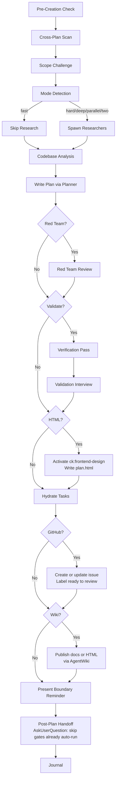

# Planning

Create detailed technical implementation plans through research, codebase analysis, solution design, and comprehensive documentation.

## Prerequisites

- **ClaudeKit CLI required:** This skill requires `ck` CLI for plan operations.
  Run `npm install -g claudekit` if not installed.

## CLI Integration

This skill orchestrates planning, but ClaudeKit CLI now owns the plan file scaffolding and phase state mutations whenever `ck` is available.

Use these commands instead of hand-editing CLI-managed plan structure:

```bash
ck plan create \
  --title "{plan title}" \
  --phases "{Research},{Implement},{Test}" \
  --dir {plan-dir} \
  --source skill

ck plan create \
  --global \
  --title "{plan title}" \
  --phases "{Research},{Implement},{Test}" \
  --dir {plan-dir} \
  --source skill

cd /absolute/path/to/plan-dir && ck plan check <phase-id> --start
cd /absolute/path/to/plan-dir && ck plan check <phase-id>
cd /absolute/path/to/plan-dir && ck plan uncheck <phase-id>
ck plan status /absolute/path/to/plan.md
ck config ui --port 3456
```

Rules:
- Use `ck plan create` to scaffold `plan.md` and `phase-*.md` when the CLI is available.
- When `--html` is present, the final user-facing plan artifact is `plan.html`.
  Use `ck plan create` only when a plan directory, active-plan metadata, or a
  `--github` companion `plan.md` index is needed. Do not duplicate the full plan
  body across Markdown and HTML.
- Default scope is project-local (`./plans/` under the current project).
- Global scope is conditional: use `ck plan create --global ...` or fall back to global scope only when no project context exists.
- Use `ck plan check` / `ck plan uncheck` for phase status changes.
- Do not hand-edit the phases table for status toggles or structural updates when CLI commands are available.
- Use the dashboard at `http://localhost:3456/plans` for visual plan management.
- **Generated-file write guard:** `ck plan create` creates existing `plan.md` and `phase-XX-*.md` stub files. Before composing long replacement content, run a read pass over `plan.md` and **every generated phase stub**. A directory listing is not enough. Claude Code enforces Read-before-Write on existing files; skipping any stub read causes that file's Write to be rejected after wasting the full Write payload. The stubs are tiny, so read them all first, then fill them.

### Mandatory Generated-File Read Pass

After `ck plan create` and before the first long Write/Edit to any generated plan file:

1. Enumerate generated files: `plan.md` plus all `phase-*.md`.
2. Read `plan.md`.
3. Read every generated `phase-*.md` stub, including future phases you have not drafted yet.
4. Only after the read pass, write or edit the full content for `plan.md` and each phase.

Do not draft or submit a full phase body for a generated stub that has not been read in the current session.

### Canonical Phase File Template

Use this structure when filling each `phase-XX-*.md`. Loaded once with the skill — no per-file Read needed to learn it. Frontmatter fields match the CLI's phase schema; section headers match `documentation-management.md` so phase files stay consistent across plans.

````markdown
---
phase: <N>
title: "<Phase Name>"
status: pending       # pending | in-progress | completed
priority: P2          # P1 | P2 | P3
dependencies: []      # phase IDs this blocks on
---

# Phase <id>: <Name>

## Overview
<1-2 sentences describing what this phase delivers>

## Requirements
- Functional: ...
- Non-functional: ...

## Architecture
<Design, data flow, component interactions>

## Related Code Files
- Create: `path/...`
- Modify: `path/...`
- Delete: `path/...`

## Implementation Steps
1. ...
2. ...

## Success Criteria
- [ ] ...

## Risk Assessment
<Risks + mitigations>
````

**IMPORTANT:** Before you start, scan unfinished plans in the active scope first:
- Project scope: `./plans/`
- Global scope: the configured global plans root
  - Default when unset: `~/.claude/plans/`

If there are relevant plans overlapping your upcoming plan, update them as well. If you're unsure or need more clarifications, use `AskUserQuestion` tool to ask the user.

### Scope Selection

- **Project scope** is the default whenever the current working tree has project context.
- **Global scope** is allowed only when:
  - the user explicitly asks for it via `--global`, or
  - there is no project context to anchor a local plan.
- **No project context** means no `.git`, `package.json`, or `CLAUDE.md` was found in the ancestor chain.
- Keep scope honest in prose and examples: the skill describes CLI-owned behavior, it does not implement scope resolution itself.

### Cross-Plan Dependency Detection

During the pre-creation scan, detect and mark blocking relationships between plans:

1. **Scan** — Read `plan.md` frontmatter of each unfinished plan (status != `completed`/`cancelled`)
2. **Compare scope** — Check overlapping files, shared dependencies, same feature area
3. **Classify relationship:**
   - New plan needs output of existing plan → new plan `blockedBy: [existing-plan-dir]`
   - New plan changes something existing plan depends on → existing plan `blockedBy: [new-plan-dir]`, new plan `blocks: [existing-plan-dir]`
   - Cross-scope dependency → use `global:` or `project:` prefixes
   - Mutual dependency → both plans reference each other in `blockedBy`/`blocks`
4. **Bidirectional update** — When relationship detected, update BOTH `plan.md` files' frontmatter
5. **Ambiguous?** → Use `AskUserQuestion` with header "Plan Dependency", present detected overlap, ask user to confirm relationship type (blocks/blockedBy/none)

**Frontmatter fields**:
```yaml
blockedBy: [260301-1200-auth-system]            # Same-scope dependency
blockedBy: [global:260301-1200-auth-system]     # Cross-scope dependency
blocks: [project:260228-0900-user-dashboard]    # Explicit project-scope dependency
```

**Status interaction:** `ck plan status` is the authoritative inspection surface. Same-scope bare refs stay in the current scope; prefixed refs resolve against the explicit project/global root. Missing refs should warn and show `not found`, not hard-fail the plan.

## Default (No Arguments)

If invoked with a task description, proceed with planning workflow. If invoked WITHOUT arguments or with unclear intent, use `AskUserQuestion` to present available operations:

| Operation | Description |
|-----------|-------------|
| `(default)` | Create implementation plan for a task |
| `archive` | Write journal entry & archive plans |
| `red-team` | Adversarial plan review |
| `validate` | Critical questions interview |

Present as options via `AskUserQuestion` with header "Planning Operation", question "What would you like to do?".

## Workflow Modes

Default: auto-detect planning mode (analyze task complexity and pick mode).

| Flag | Mode | Research | Red Team | Validation | Cook Flag |
|------|------|----------|----------|------------|-----------|
| `--auto` | Auto-detect | Follows mode | Follows mode | Follows mode | Follows mode |
| `--fast` | Fast | Skip | Skip | Skip | (none) |
| `--hard` | Hard | 2 researchers | Yes | Optional | (none) |
| `--deep` | Deep | 2-3 researchers + per-phase scout | Yes | Yes | (none) |
| `--parallel` | Parallel | 2 researchers | Yes | Optional | `--parallel` |
| `--two` | Two approaches | 2+ researchers | After selection | After selection | (none) |

**Composable flags** (combine with any mode):
| Flag | Effect |
|------|--------|
| `--tdd` | Add tests-first structure to each phase for regression-safe refactors |
| `--no-tasks` | Skip task hydration |
| `--html` | Output a self-contained editorial interactive HTML plan with visible phase outlines, markdown detail modals, and optional generated watercolor technical sketch imagery |
| `--github` | Create or update a GitHub issue after plan validation with branch, summary, plan links, open questions, and `ready to review` |
| `--wiki` | Publish the final reviewed plan docs or HTML artifact to AgentWiki via CLI or MCP when available |

### HTML Output Mode (`--html`)

When `--html` is present, activate `/ck:frontend-design` before composing the
HTML artifact. If `ck:frontend-design` requires design intelligence, follow its
`ck:ui-ux-pro-max` activation rule before styling.

**Artifact rules:**
- Write the primary output as `plan.html` in the selected plan directory.
- The HTML file must be self-contained: inline CSS and JavaScript, no build
  step, no network-required assets.
- If generated image assets are used, embed selected images as data URIs so
  `plan.html` remains portable; keep source images under `{plan-dir}/assets/`
  for review only.
- Generate `plan.html` after red-team and validation gates so the HTML reflects
  the final reviewed plan. Markdown files produced for CLI scaffolding or gate
  compatibility are not the user-facing deliverable in this mode.
- If another workflow requires `plan.md` (for example `--github`), keep
  `plan.md` as a concise index that points to `plan.html`; do not duplicate the
  full plan body unless a downstream `/ck:cook` handoff explicitly needs it.
- Include accessible responsive UI, keyboard-friendly controls, and reduced
  motion handling.

**Content requirements:**
- Plan overview and phase roadmap.
- Main page must show a concise outline summary for every phase: title, status,
  priority, dependencies, objective, 3-6 key bullets, related files,
  success criteria highlights, and test/validation gate when known.
- Each phase outline must open a detail modal rendering the full phase markdown:
  headings, lists, checkboxes, tables, fenced code, inline code, blockquotes,
  links, horizontal rules, and frontmatter metadata. Escape raw HTML unless a
  trusted sanitizer is bundled inline.
- User flows.
- Diagrams and charts rendered directly in HTML/CSS/SVG/Canvas.
- Interactive affordances such as tabs, filters, expandable risks, or chart
  toggles when useful.
- Citations as visible URLs for external sources, GitHub issues, docs, and
  any web references used.
- Open questions section; write "None" when there are no unresolved questions.

**Generated illustration requirements:**
- If `imagegen`, built-in `image_gen`, or `create_image` is available, generate
  1-3 raster illustrations for the HTML.
- Prompt style: technical sketch, watercolor wash, hand-drawn engineering
  notebook, ink linework, warm paper, muted red/gold accents, no text, no logo,
  no watermark.
- If image generation is unavailable or fails, continue with typographic
  diagrams / CSS-only structure and state the limitation in the final response.

**Design direction:**
- Use the editorial magazine style contract from the user's supplied guideline
  when present; otherwise use this built-in contract.
- Use warm paper `#faf7f2`, paper panels `#f0ebe1`, ink `#0a0a0a`, muted
  `#6b6258`, accent red `#b8232c`, hairline dividers, serif display, mono
  labels, and restrained sans body.
- Use print-editorial structure: cover section, running mono slide tags/folios,
  generous whitespace, asymmetric grids, rule lines, pull quotes, stat bands,
  and fixed nav dots when useful.
- Avoid gradients, drop shadows, rounded cards, pure white backgrounds, generic
  SaaS styling, decorative bokeh/orbs, emoji icons, and hidden instructions.
- Use accent only for italic serif emphasis, eyebrows, active states, left
  rules, and small data highlights. Include subtle CSS paper grain.
- Keep typography readable on mobile and desktop; no horizontal scrolling.

### GitHub Issue Mode (`--github`)

When `--github` is present, create or update a GitHub issue after validation and
red-team gates finish and before implementation handoff.

**Required issue fields:**
- Branch name from `git branch --show-current`.
- Plan summary.
- Repo-relative link to `plan.md`.
- Repo-relative link to `plan.html` when `--html` is present.
- Repo-relative link to the brainstorm report when one exists; otherwise state
  `Brainstorm report: None found`.
- Open questions when present; otherwise state `Open questions: None`.
- Acceptance criteria from the validated plan.

**Required label:** `ready to review`.

**Issue creation rules:**
```bash
gh label list --json name --jq '.[].name' | grep -Fx "ready to review" >/dev/null \
  || gh label create "ready to review" --color "0E8A16" --description "Plan ready for human review"
gh issue create --title "<plan title>" --body-file "<body.md>" --label "ready to review"
```

- If an issue already exists for the same plan or branch, update/comment on it
  instead of creating a duplicate.
- All links posted to GitHub must be repo-relative. Do not post absolute local
  filesystem paths.
- Redact secrets, env values, tokens, customer data, private logs, and local
  machine-specific details before writing issue bodies or comments.
- If `gh` cannot create labels or issues, stop and report the exact error.

### Combined `--html --github`

`plan.html` is the authoritative plan. Create a short companion `plan.md` index
only to satisfy the GitHub issue's stable `plan.md` link requirement. The issue
must include both relative links.

### AgentWiki Publish Mode (`--wiki`)

When `--wiki` is present, publish the final reviewed plan artifact to AgentWiki
after validation/red-team gates and after `plan.html` generation when `--html`
is also present.

**Availability check:**
1. Prefer AgentWiki CLI when `command -v agentwiki` succeeds and
   `agentwiki whoami` confirms auth.
2. If CLI is unavailable, use AgentWiki MCP tools when exposed in the session
   for document create/update, file upload, share links, or static site upload.
3. If neither is available or auth fails, do not block plan creation. Report
   "AgentWiki publish skipped" with the exact missing capability.

**Markdown/document publish:**
- Publish a reviewed Markdown artifact. If the plan spans `phase-*.md` files,
  create `{plan-dir}/wiki-publish.md` as a concise combined document or index
  before uploading.
- CLI path:
  ```bash
  agentwiki doc upload "{publish-md}" \
    --title "{plan title}" \
    --description "{short summary}" \
    --category "plans" \
    --tags "ck-plan,{repo-slug},{branch}" \
    --json
  agentwiki doc publish "{document-id}" \
    --description "{short summary}" \
    --json
  ```
- If public publish is not desired or unavailable, use
  `agentwiki doc share "{document-id}" --json` and report the share URL.

**HTML/static-site publish:**
- For `--html`, upload the self-contained `plan.html`:
  ```bash
  agentwiki sites upload "{plan-dir}/plan.html" \
    --description "{plan title} - ck:plan HTML artifact" \
    --auto-summary
  ```
- Capture the returned site URL and include it in the final response. If
  `--github` is also present, comment on or update the issue with the wiki URL.

**MCP fallback:**
- Use AgentWiki MCP document tools for Markdown content when available
  (`document_create`/`document_update`, upload, share-link equivalents).
- Use MCP static-site upload only if the active toolset exposes that exact
  capability. Do not fake a hosted URL from a raw file upload.

**Security rules:**
- Redact secrets, env values, tokens, customer data, private logs, and
  local-machine-only paths before publishing.
- Prefer repo-relative paths and public-safe summaries.
- Publish only final reviewed artifacts; do not publish intermediate research
  notes unless the user explicitly asks.

Load: `references/workflow-modes.md` for auto-detection logic, per-mode workflows, context reminders.

## When to Use

- Planning new feature implementations
- Architecting system designs
- Evaluating technical approaches
- Creating implementation roadmaps
- Breaking down complex requirements

## Core Responsibilities & Rules

Always honoring **YAGNI**, **KISS**, and **DRY** principles.
**Be honest, be brutal, straight to the point, and be concise.**

### 0. Scope Challenge
Load: `references/scope-challenge.md`
**Skip if:** `--fast` mode or trivial task (single file fix, <20 word description)

### 1. Research & Analysis
Load: `references/research-phase.md`
**Skip if:** Fast mode or provided with researcher reports

### 2. Codebase Understanding
Load: `references/codebase-understanding.md`
**Skip if:** Provided with scout reports

### 3. Solution Design
Load: `references/solution-design.md`

### 4. Plan Creation & Organization
Load: `references/plan-organization.md`

### 5. Task Breakdown & Output Standards
Load: `references/output-standards.md`

## Process Flow (Authoritative)



**This diagram is the authoritative workflow.** Prose sections below provide detail for each node.

## Workflow Process

1. **Pre-Creation Check** → Check Plan Context for active/suggested/none
1b. **Cross-Plan Scan** → Scan unfinished plans, detect `blockedBy`/`blocks` relationships, update both plans
1c. **Scope Challenge** → Run Step 0 scope questions, select mode (see `references/scope-challenge.md`)
    **Skip if:** `--fast` mode or trivial task
2. **Mode Detection** → Auto-detect or use explicit flag (see `workflow-modes.md`)
3. **Research Phase** → Spawn researchers (skip in fast mode)
4. **Codebase Analysis** → Read docs, scout if needed
5. **Plan Documentation** → Write comprehensive plan via planner subagent
6. **Red Team Review** → Run `/ck:plan red-team {plan-path}` (hard/deep/parallel/two modes)
7. **Post-Plan Validation** → Run `/ck:plan validate {plan-path}` (hard/deep/parallel/two modes)
8. **HTML Artifact** → If `--html`, activate `/ck:frontend-design` and write final reviewed `plan.html` as the primary output
9. **Hydrate Tasks** → Create Claude Tasks from phases (default on, `--no-tasks` to skip)
10. **GitHub Issue** → If `--github`, create/update issue and apply `ready to review`
11. **AgentWiki Publish** → If `--wiki`, publish final docs or `plan.html` when AgentWiki CLI/MCP is available
12. **Boundary Reminder** → Present optional next-step commands with absolute path
13. **Journal** → Run `/ck:journal` to write a concise technical journal entry upon completion

### Whole-Plan Consistency Gate

This gate is mandatory after `/ck:plan validate` or `/ck:plan red-team` edits any plan file.
Load: `references/verification-roles.md` → "Whole-Plan Consistency Sweep".

Before recommending `/ck:cook`, re-read `plan.md` and every `phase-*.md` file. Search all plan files for stale terms, rejected assumptions, renamed APIs/files/fields, superseded decisions, and duplicate embedded drafts/contracts. Reconcile contradictions across the entire plan, not only the edited phase.

If unresolved contradictions remain, report them and ask the user. Do not recommend cook until the whole-plan consistency sweep reports zero unresolved contradictions.

## Output Requirements
**IMPORTANT:** Invoke "/ck:project-organization" skill to organize the outputs.

- DO NOT implement code - only create plans
- Respond with plan file path and summary
- Ensure self-contained plans with necessary context
- Include code snippets/pseudocode when clarifying
- With `--html`, respond with the `plan.html` path, the companion `plan.md`
  index path when one exists, and a short note that HTML is authoritative.
- With `--github`, respond with the GitHub issue URL and confirm the
  `ready to review` label was applied.
- With `--wiki`, respond with the AgentWiki document/share/site URL when
  published, or state the exact reason publishing was skipped.
- Fully respect the `./docs/development-rules.md` file

## Task Management

Plan files = persistent. Tasks = session-scoped. Hydration bridges the gap.

**Default:** Auto-hydrate tasks after plan files are written. Skip with `--no-tasks`.
**3-Task Rule:** <3 phases → skip task creation.
**Fallback:** Task tools (`TaskCreate`/`TaskUpdate`/`TaskGet`/`TaskList`) are CLI-only — unavailable in VSCode extension. If they error, use `TodoWrite` for tracking. Plan files remain the source of truth; hydration is an optimization, not a requirement.

Load: `references/task-management.md` for hydration pattern, TaskCreate patterns, cook handoff protocol.

### Hydration Workflow
1. Write plan.md + phase files (persistent layer)
2. TaskCreate per phase with `addBlockedBy` chain (skip if Task tools unavailable)
3. TaskCreate for critical/high-risk steps within phases (skip if Task tools unavailable)
4. Metadata: phase, priority, planDir, phaseFile
5. Cook picks up via TaskList (same session) or re-hydrates (new session)

## Active Plan State

Check `## Plan Context` injected by hooks:
- **"Plan: {path}"** → Active plan. Ask "Continue? [Y/n]"
- **"Suggested: {path}"** → Branch hint only. Ask if activate or create new.
- **"Plan: none"** → Create new using `Plan dir:` from `## Naming`

After creating plan: `node .claude/scripts/set-active-plan.cjs {plan-dir}`
Reports: Active plans → plan-specific path. Suggested → default path.

### Important
**DO NOT** create plans or reports in arbitrary user directories.
**MUST** create plans or reports in one of these allowed roots:
- project scope → current working project directory
- global scope → configured global plans root
  - Default when unset: `~/.claude/plans/`

## Subcommands

| Subcommand | Reference | Purpose |
|------------|-----------|---------|
| `/ck:plan archive` | `references/archive-workflow.md` | Archive plans + write journal entries |
| `/ck:plan red-team` | `references/red-team-workflow.md` | Adversarial plan review with hostile reviewers |
| `/ck:plan validate` | `references/validate-workflow.md` | Validate plan with critical questions interview |

## Post-Plan Handoff (MANDATORY at session end)

After `plan.md` + phase files are written and the user has reviewed/approved them, use `AskUserQuestion` to offer the appropriate next step. Recommend the option that best fits the plan's risk/scope; recommended option listed FIRST and labelled "(Recommended)".

| Option | Recommend When | Why |
|--------|----------------|-----|
| `/ck:plan validate` | Plan is moderate-to-complex; user wants critical-questions interview before implementation | Cheapest gate — surfaces unspecified assumptions, missing acceptance criteria, hand-wavy phases |
| `/ck:plan red-team` | Plan touches security, auth, payments, data integrity, public APIs, infra, or has high blast radius | Adversarial reviewers stress-test the plan for failure modes, attack vectors, and missing edge cases |
| `/ck:cook <plan-path>` | Plan is small / well-understood / low-risk and user wants to start implementation | Skip extra gates; go straight to implementation |
| End session | User wants to review/share plan before deciding | Stop with plan path returned |

**Skip this step ONLY when:**
- The current invocation IS already a subcommand (`validate`, `red-team`, `archive`) — those have their own terminal handoff.
- User explicitly said "just plan, don't suggest next step".

**Skip an individual option ONLY when the active mode already auto-ran that gate (per Workflow Process Steps 6-7):**
- Omit `/ck:plan red-team` from the offered options when mode is `--hard`, `--deep`, `--parallel`, or `--two` (Step 6 already ran adversarial review).
- Omit `/ck:plan validate` from the offered options when mode is `--deep` (Step 7 already ran validation).
- If both gates already ran, the Post-Plan Handoff still fires but offers only `/ck:cook <plan-path>` and `End session`.

After selection: invoke the chosen command with the plan path as argument for continuity.

## Quality Standards

- Thorough and specific, consider long-term maintainability
- Research thoroughly when uncertain
- Address security and performance concerns
- Detailed enough for junior developers
- Validate against existing codebase patterns

**Remember:** Plan quality determines implementation success. Be comprehensive and consider all solution aspects.

## Workflow Position

**Typically follows:** `/ck:brainstorm` (after exploring options), `/ck:scout` (after codebase discovery)
**May precede:** `/ck:cook` after user approval (otherwise stop with plan path and next-step options)
**Related:** `/ck:brainstorm` (explore before planning), `/ck:cook` (execute after planning)
