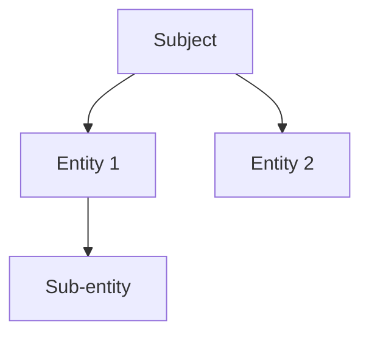
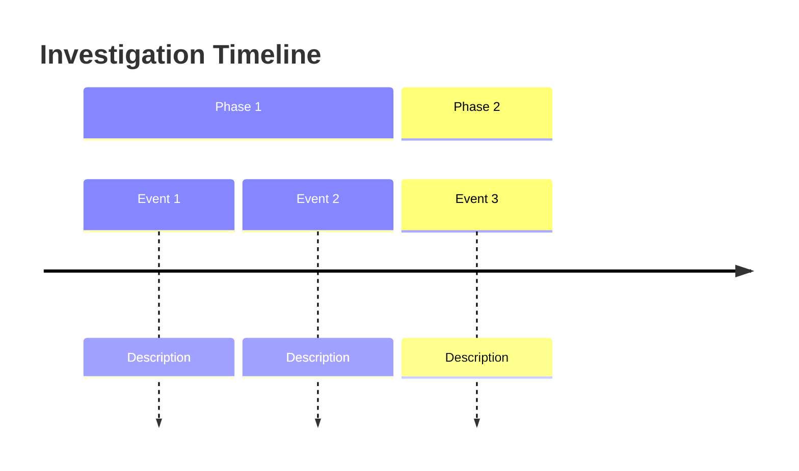

# Obsidian Vault Setup Guide

## Overview

Obsidian is a powerful knowledge management tool ideal for OSINT investigations. This guide provides a complete vault structure optimized for organizing investigations, tracking entities, and visualizing connections.

---

## Folder Structure Template

```
OSINT-Vault/
├── 00-Inbox/
│   ├── Raw Clippings/
│   ├── Quick Notes/
│   └── Unsorted/
│
├── 01-Active-Investigations/
│   ├── Investigation-001-Name/
│   │   ├── 00-Overview.md
│   │   ├── 01-Timeline.md
│   │   ├── 02-Entities/
│   │   │   ├── Person-Name.md
│   │   │   ├── Domain-example.com.md
│   │   │   └── Organization-Name.md
│   │   ├── 03-Evidence/
│   │   │   ├── Document-Filename.md
│   │   │   └── Screenshot-Description.md
│   │   ├── 04-Analysis/
│   │   │   ├── Pattern-Analysis.md
│   │   │   └── Risk-Assessment.md
│   │   └── 05-Reports/
│   │       ├── Technical-Report.md
│   │       └── Simple-Summary.md
│   └── Investigation-002-Name/
│       └── [same structure]
│
├── 02-Entity-Database/
│   ├── People/
│   ├── Organizations/
│   ├── Domains/
│   ├── IP-Addresses/
│   ├── Usernames/
│   ├── Email-Addresses/
│   └── Assets/
│
├── 03-Templates/
│   ├── Investigation-Template.md
│   ├── Person-Template.md
│   ├── Organization-Template.md
│   ├── Domain-Template.md
│   ├── Timeline-Template.md
│   ├── Evidence-Template.md
│   └── Report-Template.md
│
├── 04-Resources/
│   ├── OSINT-Resources.md
│   ├── Tool-Guides/
│   ├── Legal-References/
│   └── Best-Practices/
│
├── 05-Archive/
│   ├── Completed-Investigations/
│   └── Reference-Cases/
│
├── 99-Attachments/
│   ├── Images/
│   ├── Documents/
│   ├── Screenshots/
│   └── Exports/
│
└── Dashboard.md
```

---

## Note Templates

### Investigation Overview Template

```markdown
---
created: {{date:YYYY-MM-DD}}
updated: {{date:YYYY-MM-DD}}
investigation_id: INV-{{date:YYYYMM}}-001
type: investigation
status: active
priority: high
---

# Investigation: {{title}}

## Overview
**Subject:** 
**Type:** [Person/Domain/Organization/Event]
**Objective:** 
**Status:** #status/active

## Summary
<!-- Brief summary of what this investigation covers -->

## Key Findings
- Finding 1
- Finding 2
- Finding 3

## Confidence Levels
- 🟢 High: 
- 🟡 Medium: 
- 🔴 Low: 

## Entity Map


## Quick Links
- [[Timeline]]
- [[Entities]]
- [[Evidence]]
- [[Analysis]]

## Related
- [[Related Investigation]]
- [[Related Person]]

## Tasks
- [ ] Task 1
- [ ] Task 2
- [ ] Task 3
```

### Person Entity Template

```markdown
---
created: {{date:YYYY-MM-DD}}
entity_type: person
confidence: medium
aliases: []
status: active
---

# {{title}}

## Basic Information
**Full Name:** 
**Aliases:** 
**Date of Birth:** 
**Age:** 
**Gender:** 
**Nationality:** 

## Contact Information
**Email:** 
**Phone:** 
**Website:** 

## Professional
**Current Employer:** 
**Position:** 
**Industry:** 
**LinkedIn:** 

## Digital Presence
**Usernames:** 
**Social Media:**
- Twitter: 
- Facebook: 
- Instagram: 
- LinkedIn: 
- Other: 

## Relationships
**Family:**
- 

**Associates:**
- 

**Organizations:**
- 

## Timeline
| Date | Event | Source |
|------|-------|--------|
| | | |

## Notes

## Confidence Assessment
- Identity: 🟢 High / 🟡 Medium / 🔴 Low
- Employment: 🟢 High / 🟡 Medium / 🔴 Low
- Location: 🟢 High / 🟡 Medium / 🔴 Low

## Sources
1. 

## Related
- [[Investigation]]
```

### Domain Template

```markdown
---
created: {{date:YYYY-MM-DD}}
entity_type: domain
confidence: high
status: active
---

# {{title}}

## Basic Information
**Domain:** {{title}}
**Registration Date:** 
**Expiration Date:** 
**Registrar:** 
**Status:** 

## DNS Information
**IP Address:** 
**Nameservers:** 
**MX Records:** 
**Subdomains:** 

## Ownership
**Registrant:** 
**Organization:** 
**Email:** 
**Phone:** 
**Address:** 

## Web Presence
**Web Server:** 
**Technologies:** 
**CMS:** 
**SSL Certificate:** 

## Security
**Threat Intelligence:** 
**Blacklist Status:** 
**Vulnerabilities:** 

## Timeline
| Date | Event | Details |
|------|-------|---------|
| | Registration | |
| | DNS Change | |

## Notes

## Related
- [[Person]]
- [[Organization]]
- [[Investigation]]
```

### Timeline Template

```markdown
---
created: {{date:YYYY-MM-DD}}
type: timeline
investigation: 
---

# Timeline: {{title}}

## Chronology

### {{date:YYYY}}
**Month:**
- **Day:** Event description
  - Source: 
  - Confidence: 🟢/🟡/🔴
  - Related: [[Entity]]

### {{date:YYYY}}
**Month:**
- **Day:** 

## Visual Timeline


## Analysis
**Patterns Observed:**
- 

**Gaps in Timeline:**
- 

## Related
- [[Investigation]]
```

### Evidence Template

```markdown
---
created: {{date:YYYY-MM-DD}}
type: evidence
format: [image/document/audio/video/webpage]
confidence: medium
source: 
---

# Evidence: {{title}}

## Metadata
**Source:** 
**Date Obtained:** 
**Date Created:** (from metadata)
**Hash (SHA256):** 
**Filename:** 

## Description
<!-- What is this evidence? -->

## Context
<!-- How does this fit into the investigation? -->

## Analysis
<!-- Initial observations -->

## Chain of Custody
| Date | Action | By |
|------|--------|-----|
| | Obtained | |
| | Analyzed | |

## Storage
**Location:** 
**Backup:** 

## Related
- [[Investigation]]
- [[Entity]]
```

### Report Template

```markdown
---
created: {{date:YYYY-MM-DD}}
type: report
investigation: 
classification: confidential
---

# Investigation Report: {{title}}

**Date:** {{date:YYYY-MM-DD}}
**Investigation ID:** 
**Analyst:** 
**Classification:** Confidential

## Executive Summary

## Subject Profile

## Key Findings

## Entity Relationships

## Timeline

## Sources

## Recommendations

## Appendix
```

---

## Link Syntax

### Internal Links

**Basic Links:**
```markdown
[[Person Name]]
[[Domain Name]]
[[Investigation Name]]
```

**Aliased Links:**
```markdown
[[Person Name|the subject]]
[[Domain Name|primary website]]
```

**Embedded Links:**
```markdown
![[Person Name]]  <!-- Embeds the note content -->
![[screenshot.png]]  <!-- Embeds the image -->
```

**Block Links:**
```markdown
[[Person Name#Contact Information]]
[[Investigation#Key Findings]]
```

### Link Types (Using Dataview Plugin)

```markdown
---
entity_type: person
investigation: "[[Investigation Name]]"
associated_with:
  - "[[Person 2]]"
  - "[[Organization]]"
---
```

---

## Graph View Optimization

### For Best Graph Visualization

**1. Consistent Frontmatter:**
All notes should have:
```yaml
---
entity_type: [person|organization|domain|investigation|evidence]
status: [active|archived|closed]
confidence: [high|medium|low]
---
```

**2. Use Tags for Filtering:**
```markdown
#person #target #high-priority
#domain #suspicious
#investigation #active
```

**3. Group by Entity Type:**
Configure graph view:
- Color: entity_type
- Size: link count
- Group: investigation

**4. Link Liberally:**
Every entity should link to:
- Parent investigation
- Related entities
- Source evidence
- Timeline events

### Graph View Settings

**Recommended Configuration:**
```json
{
  "collapse-filter": false,
  "search": "",
  "localBacklinks": false,
  "localForelinks": false,
  "localInterlinks": false,
  "showTags": true,
  "showAttachments": false,
  "hideUnresolved": false,
  "showOrphans": true,
  "showArrow": true,
  "textFadeThreshold": 0.7,
  "nodeSizeMultiplier": 1.2,
  "lineSizeMultiplier": 1.0,
  "centerStrength": 0.5,
  "repelStrength": 12,
  "linkDistance": 200,
  "linkStrength": 1.0
}
```

---

## Tagging Conventions

### Standard Tags

**Investigation Status:**
- `#status/active`
- `#status/archived`
- `#status/closed`
- `#status/priority`

**Entity Types:**
- `#person`
- `#organization`
- `#domain`
- `#ip-address`
- `#username`
- `#email`
- `#asset`

**Confidence Levels:**
- `#confidence/high`
- `#confidence/medium`
- `#confidence/low`
- `#confidence/speculative`

**Evidence Types:**
- `#evidence/document`
- `#evidence/screenshot`
- `#evidence/audio`
- `#evidence/video`
- `#evidence/web-archive`

**Priority Flags:**
- `#priority/critical`
- `#priority/high`
- `#priority/medium`
- `#priority/low`

### Tag Hierarchy

```
#investigation
  #investigation/active
  #investigation/archived
  
#entity
  #entity/person
  #entity/organization
  #entity/domain
  
#evidence
  #evidence/verified
  #evidence/unverified
  
#analysis
  #analysis/patterns
  #analysis/detect
```

---

## Recommended Plugins

### Core Investigation Plugins

**1. Dataview**
- Query your vault like a database
- Create dynamic tables and lists
- Essential for entity tracking

**2. Graph Analysis**
- Advanced graph metrics
- Path finding between notes
- Community detection

**3. Breadcrumbs**
- Visualize note hierarchies
- Parent/child relationships
- Matrix views

**4. Kanban**
- Track investigation tasks
- Visual workflow management
- Case status boards

**5. Templater**
- Advanced templates
- Automatic date insertion
- Dynamic content

**6. QuickAdd**
- Quick note creation
- Capture templates
- Command palette shortcuts

### Installation Commands

```markdown
Install via Community Plugins:
1. Settings → Community Plugins → Browse
2. Search and install each plugin
3. Enable and configure
```

---

## Dashboard Setup

### Main Dashboard

```markdown
# OSINT Investigation Dashboard

## Active Investigations
```dataview
TABLE investigation_id, type, status, priority
FROM #investigation/active
SORT priority DESC, created DESC
```

## Recent Entities
```dataview
LIST
FROM #entity
SORT created DESC
LIMIT 10
```

## High Priority Items
```dataview
TASK
FROM #priority/critical OR #priority/high
WHERE !completed
SORT due ASC
```

## Quick Stats
- **Active Investigations:** `=length(this.file.inlinks)`
- **Total Entities:** `=length([#entity])`
- **Pending Tasks:** `=length([#task])`

## Quick Links
- [[00-Inbox]]
- [[01-Active-Investigations]]
- [[02-Entity-Database]]
- [[04-Resources]]
```

### Investigation Dashboard

```markdown
# Investigation Dashboard: {{investigation_name}}

## Overview
[[00-Overview|Investigation Overview]]

## Entities
```dataview
LIST
FROM "01-Active-Investigations/{{investigation_name}}/02-Entities"
```

## Timeline
[[01-Timeline|View Timeline]]

## Evidence
```dataview
TABLE source, confidence
FROM "01-Active-Investigations/{{investigation_name}}/03-Evidence"
```

## Tasks
- [ ] Task 1
- [ ] Task 2

## Notes
Quick notes area...
```

---

## Best Practices

1. **Daily Notes** - Use daily notes for investigation logging
2. **Atomic Notes** - One entity per note, link liberally
3. **Source Everything** - Every fact needs a source link
4. **Use Templates** - Consistency saves time
5. **Tag Appropriately** - Makes filtering and queries work
6. **Back Up Regularly** - Use Obsidian Sync or Git
7. **Graph Reviews** - Check graph view for connection gaps
8. **Archive Completed** - Move finished investigations to archive
9. **Review Periodically** - Update confidence levels as new info arrives
10. **Export Options** - Know how to export for sharing (PDF, Markdown)

---

## Dataview Query Examples

### List All People in Investigation
```dataview
LIST
FROM #person
WHERE investigation = [[Current Investigation]]
```

### Table of Domains with IPs
```dataview
TABLE ip_address, registrar, confidence
FROM #domain
SORT confidence DESC
```

### Timeline of Events
```dataview
TABLE event_date, description, source
FROM "01-Active-Investigations"
WHERE file.name = "Timeline"
FLATTEN events
```

### Unverified Evidence
```dataview
LIST
FROM #evidence
WHERE confidence = "low"
```
