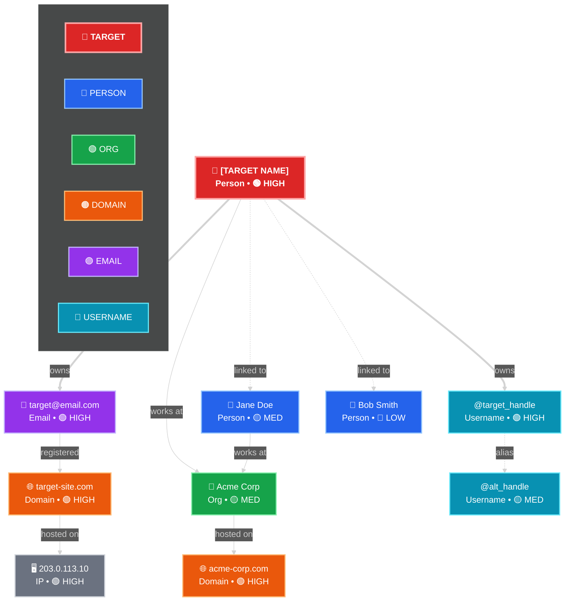
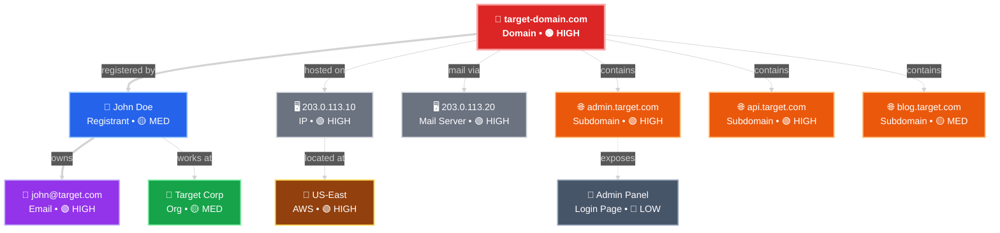
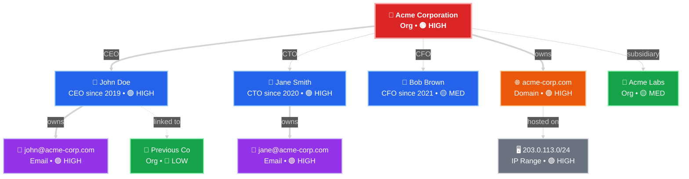
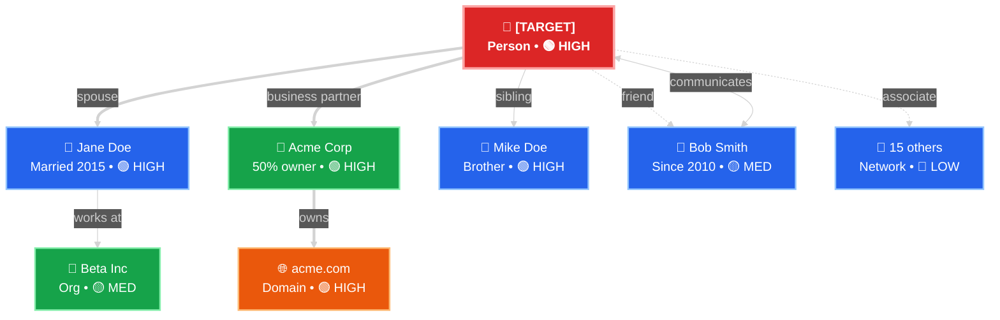

# Chart Templates v3.0

Visualization templates for OSINT investigations. **ASCII is the primary format** — renders universally in any terminal, markdown viewer, or exported document. Mermaid available as optional rich fallback when the user explicitly requests it.

**Rule: All `/graph`, `/render`, `/pathfind`, and `/show-connections` commands produce ASCII by default.** Mermaid only on explicit `--mermaid` flag.

---

## 1. Entity Relationship Maps (ASCII — Primary)

### How to Use

When rendering entity maps, **always use ASCII box-drawing characters first**. Replace placeholder values with real data. Use the emoji + type labels to distinguish entity types. Confidence shown as `[n/5]` trust score badge.

### ASCII Entity Map: Person Investigation

```
╔══════════════════════════════════════════════════════════════════════════════╗
║                        ENTITY RELATIONSHIP MAP                              ║
║                        Subject: [TARGET NAME]                               ║
╠══════════════════════════════════════════════════════════════════════════════╣
║                                                                              ║
║  ┌─────────────────────────────────┐                                         ║
║  │ 🎯 [TARGET NAME]         [5/5] │                                         ║
║  │    Person  •  PRIMARY           │                                         ║
║  └──────┬──────────┬──────────┬────┘                                         ║
║         │ owns     │ owns     │ works_at                                     ║
║         ▼          ▼          ▼                                               ║
║  ┌────────────┐ ┌────────────┐ ┌────────────────┐                            ║
║  │📧 Email    │ │@ Username  │ │🏢 Organization │                            ║
║  │target@x.com│ │@target_usr │ │Acme Corp       │                            ║
║  │      [4/5] │ │      [4/5] │ │          [3/5] │                            ║
║  └──────┬─────┘ └──────┬─────┘ └────────┬───────┘                            ║
║         │ registered   │ alias          │ owns                               ║
║         ▼              ▼                ▼                                     ║
║  ┌────────────┐ ┌────────────┐ ┌────────────────┐                            ║
║  │🌐 Domain   │ │@ Alt Handle│ │🌐 Domain       │                            ║
║  │target.com  │ │@alt_handle │ │acme-corp.com   │                            ║
║  │      [4/5] │ │      [3/5] │ │          [4/5] │                            ║
║  └──────┬─────┘ └────────────┘ └────────────────┘                            ║
║         │ hosted_on                                                          ║
║         ▼                                                                    ║
║  ┌────────────┐     ┌ ─ ─ ─ ─ ─ ─┐                                          ║
║  │🖥 IP Addr  │     │👤 Jane Doe  │                                          ║
║  │203.0.113.10│·····│  linked_to  │                                          ║
║  │      [4/5] │     │       [2/5] │                                          ║
║  └────────────┘     └ ─ ─ ─ ─ ─ ─┘                                          ║
║                                                                              ║
║  LEGEND                                                                      ║
║  ═══▶ owns    ───▶ confirmed link    ···▶ inferred    ┌ ─ ─┐ unverified     ║
║  [n/5] trust score    🎯 target  👤 person  📧 email  🌐 domain  🖥 IP      ║
╚══════════════════════════════════════════════════════════════════════════════╝
```

### ASCII Entity Map: Domain / Infrastructure

```
╔══════════════════════════════════════════════════════════════════════════════╗
║                        ENTITY RELATIONSHIP MAP                              ║
║                        Subject: [DOMAIN]                                    ║
╠══════════════════════════════════════════════════════════════════════════════╣
║                                                                              ║
║  ┌─────────────────────────────────┐                                         ║
║  │ 🎯 target-domain.com     [5/5] │                                         ║
║  │    Domain  •  PRIMARY           │                                         ║
║  └──┬──────────┬──────────┬────────┘                                         ║
║     │registered│ hosted_on│ contains                                         ║
║     ▼          ▼          ▼                                                  ║
║  ┌──────────┐ ┌──────────┐ ┌──────────────────────────────────┐              ║
║  │👤 Regist.│ │🖥 IP     │ │  SUBDOMAINS                      │              ║
║  │John Doe  │ │203.0.113 │ │  ├── admin.target.com   [4/5]   │              ║
║  │    [3/5] │ │.10 [4/5] │ │  ├── api.target.com     [4/5]   │              ║
║  └────┬─────┘ └────┬─────┘ │  ├── blog.target.com    [3/5]   │              ║
║       │ owns       │located│  └── mail.target.com    [4/5]   │              ║
║       ▼            ▼       └──────────────────────────────────┘              ║
║  ┌──────────┐ ┌──────────┐                                                   ║
║  │📧 Email  │ │📍 US-East│                                                   ║
║  │john@tgt  │ │AWS       │                                                   ║
║  │.com [4/5]│ │    [4/5] │                                                   ║
║  └──────────┘ └──────────┘                                                   ║
║                                                                              ║
║  LEGEND                                                                      ║
║  ═══▶ owns    ───▶ confirmed    ···▶ inferred    [n/5] trust score          ║
╚══════════════════════════════════════════════════════════════════════════════╝
```

### ASCII Entity Map: Organization Network

```
╔══════════════════════════════════════════════════════════════════════════════╗
║                        ENTITY RELATIONSHIP MAP                              ║
║                        Subject: [ORGANIZATION]                              ║
╠══════════════════════════════════════════════════════════════════════════════╣
║                                                                              ║
║  ┌─────────────────────────────────┐                                         ║
║  │ 🎯 Acme Corporation      [5/5] │                                         ║
║  │    Organization  •  PRIMARY     │                                         ║
║  └──┬──────┬──────┬───────┬────────┘                                         ║
║     │CEO   │CTO   │CFO    │ owns                                             ║
║     ▼      ▼      ▼       ▼                                                  ║
║  ┌──────┐┌──────┐┌──────┐┌──────────────┐                                    ║
║  │👤John││👤Jane││👤 Bob││🌐 acme.com   │                                    ║
║  │Doe   ││Smith ││Brown ││        [4/5] │                                    ║
║  │[4/5] ││[4/5] ││[3/5] │└──────┬───────┘                                   ║
║  └──┬───┘└──┬───┘└──────┘       │ hosted_on                                 ║
║     │owns   │owns               ▼                                            ║
║     ▼       ▼            ┌──────────────┐                                    ║
║  ┌──────┐┌──────┐        │🖥 203.0.113  │                                    ║
║  │📧john││📧jane│        │.0/24   [4/5] │                                    ║
║  │@acme ││@acme │        └──────────────┘                                    ║
║  │[4/5] ││[4/5] │                                                            ║
║  └──────┘└──────┘        ┌ ─ ─ ─ ─ ─ ─ ┐                                    ║
║     │                    │🏢 Acme Labs   │                                    ║
║     │····linked_to······▶│  subsidiary   │                                    ║
║                          │        [3/5]  │                                    ║
║                          └ ─ ─ ─ ─ ─ ─ ┘                                    ║
║                                                                              ║
║  LEGEND                                                                      ║
║  ═══▶ owns    ───▶ confirmed    ···▶ inferred    ┌ ─ ─┐ unverified          ║
╚══════════════════════════════════════════════════════════════════════════════╝
```

### ASCII Entity Map: Social / Associate Network

```
╔══════════════════════════════════════════════════════════════════════════════╗
║                       ASSOCIATE NETWORK MAP                                  ║
║                       Center: [TARGET NAME]                                  ║
╠══════════════════════════════════════════════════════════════════════════════╣
║                                                                              ║
║                     ┌ ─ ─ ─ ─ ─ ─┐                                          ║
║                     │👤 Bob Smith  │                                          ║
║                     │friend  [2/5] │                                         ║
║                     └ ─ ─ ─┬─ ─ ─ ┘                                         ║
║                            │                                                 ║
║  ┌────────────────┐   ┌────┴───────────────┐   ┌────────────────┐            ║
║  │👤 Jane Doe     │   │ 🎯 [TARGET]       │   │🏢 Acme Corp   │            ║
║  │spouse    [4/5] │◄══│    Person   [5/5]  │══▶│partner   [4/5] │            ║
║  └───────┬────────┘   └──┬──────────────┬──┘   └───────┬────────┘            ║
║          │               │              │              │                     ║
║          │               │              │              │                     ║
║  ┌───────┴────────┐ ┌────┴──────────┐  │      ┌───────┴────────┐            ║
║  │🏢 Beta Inc     │ │👤 Mike Doe    │  │      │🌐 acme.com    │            ║
║  │employer  [3/5] │ │sibling  [4/5] │  │      │domain    [4/5] │            ║
║  └────────────────┘ └───────────────┘  │      └────────────────┘            ║
║                                        │                                     ║
║                                   ┌────┴──────────┐                          ║
║                                   │👤 15 others    │                          ║
║                                   │network   [1/5] │                         ║
║                                   └────────────────┘                         ║
║                                                                              ║
║  ═══ owns/family    ─── confirmed    ··· inferred    ◄══▶ bidirectional     ║
╚══════════════════════════════════════════════════════════════════════════════╝
```

---

## 1b. Entity Relationship Maps (Mermaid — Optional Fallback)

Use Mermaid **only** when user passes `--mermaid` flag. These templates render in GitHub, Obsidian, Notion, VS Code.

### How to Use

Replace placeholder values `[TARGET]`, `[ENTITY]`, etc. with real data. Use the node styles below to color-code by entity type.

### Node Style Guide

```
%%{ init: { 'theme': 'dark', 'themeVariables': { 'fontSize': '14px' } } }%%
```

| Entity Type    | Shape + Style                                    | Example                          |
|----------------|--------------------------------------------------|----------------------------------|
| TARGET         | `:::target` (red, bold border)                   | Main investigation subject       |
| PERSON         | `:::person` (blue)                               | Individual                       |
| ORGANIZATION   | `:::org` (green)                                 | Company, group                   |
| DOMAIN         | `:::domain` (orange)                             | Website, domain name             |
| EMAIL          | `:::email` (purple)                              | Email address                    |
| USERNAME       | `:::username` (teal)                             | Social handle                    |
| IP_ADDRESS     | `:::ip` (gray)                                   | Server, network                  |
| PHONE          | `:::phone` (pink)                                | Phone number                     |
| LOCATION       | `:::location` (brown)                            | Geographic location              |
| DOCUMENT       | `:::doc` (slate)                                 | File, record                     |

### Edge Style Guide

| Relationship      | Arrow Style          | Label Example        |
|--------------------|----------------------|----------------------|
| OWNERSHIP          | `==>` (thick)        | `owns`               |
| EMPLOYMENT         | `-->` (solid)        | `works at`           |
| ALIAS_OF           | `-.->`  (dotted)     | `alias`              |
| REGISTRATION       | `-->` (solid)        | `registered`         |
| HOSTING            | `-->` (solid)        | `hosted on`          |
| ASSOCIATED_WITH    | `-.->` (dotted)      | `linked to`          |
| COMMUNICATES_WITH  | `<-->` (bidirectional)| `communicates`       |
| LOCATED_AT         | `-->` (solid)        | `located at`         |
| CONTAINS           | `-->` (solid)        | `contains`           |

### Confidence Badges

Append confidence inline to node labels:

| Level     | Badge       |
|-----------|-------------|
| HIGH      | `🟢 HIGH`   |
| MEDIUM    | `🟡 MED`    |
| LOW       | `🔴 LOW`    |
| UNCERTAIN | `⚪ UNC`    |

---

### Template: Person Investigation



### Template: Domain/Infrastructure Investigation



### Template: Organization Network



### Template: Associate / Social Network



---

### Mermaid Fallback: Compact Entity Tree (ASCII)

Compact tree format for quick terminal display when full map is too large.

```
  ╔══════════════════════════════════════════════╗
  ║  🎯 [TARGET NAME]  (Person • HIGH)           ║
  ╚══════════════════╤═══════════════════════════╝
                     │
        ┌────────────┼────────────┐
        │            │            │
   ┌────┴────┐  ┌────┴────┐  ┌───┴─────┐
   │📧 EMAIL │  │@USERNAME│  │🏢 ORG   │
   │ HIGH    │  │ HIGH    │  │ MED     │
   └────┬────┘  └────┬────┘  └────┬────┘
        │            │            │
   ┌────┴────┐  ┌────┴────┐  ┌───┴─────┐
   │🌐 DOMAIN│  │@ALT_USR │  │🌐 DOMAIN│
   │ HIGH    │  │ MED     │  │ HIGH    │
   └─────────┘  └─────────┘  └─────────┘

  Legend: 🟢 HIGH  🟡 MED  🔴 LOW  ⚪ UNC
  ═══ owns   ─── linked   ··· inferred
```

---

## 2. Horizontal Timeline Template

### Investigation Timeline
```
┌─────────────────────────────────────────────────────────────────────────────┐
│                           INVESTIGATION TIMELINE                             │
│                        Case: [INVESTIGATION NAME]                            │
├─────────────────────────────────────────────────────────────────────────────┤
│                                                                              │
│   2024                                                                       │
│   JAN      FEB      MAR      APR      MAY      JUN      JUL                 │
│    │        │        │        │        │        │        │                   │
│    ▼        ▼        ▼        ▼        ▼        ▼        ▼                   │
│ ┌──┴──┐ ┌──┴──┐ ┌──┴──┐ ┌──┴──┐ ┌──┴──┐ ┌──┴──┐ ┌──┴──┐                   │
│ │START│ │RECON│ │SOC  │ │DEEP │ │PIVOT│ │ANALYSIS│ │REPORT│                  │
│ │Day 1│ │Week 1│ │Media│ │Dive │ │Point│ │      │ │      │                  │
│ │     │ │     │ │Week2│ │Week3│ │Found│ │Week 4│ │Week 5│                  │
│ └──┬──┘ └──┬──┘ └──┬──┘ └──┬──┘ └──┬──┘ └──┬──┘ └──┬──┘                   │
│    │       │       │       │       │       │       │                        │
│    ●───────●───────●───────●───────●───────●───────●                        │
│                                                                              │
│ MILESTONES:                                                                  │
│  ▼ Day 3: Target identified                                                  │
│          ▼ Day 12: First pivot discovered                                    │
│                    ▼ Day 18: Critical finding confirmed                      │
│                             ▼ Day 25: Network mapped                         │
│                                      ▼ Day 30: Report finalized              │
│                                                                              │
│ Duration: 35 days | Status: ████████████████░░░░ 80% Complete                │
└─────────────────────────────────────────────────────────────────────────────┘
```

### Event-Based Timeline
```
┌─────────────────────────────────────────────────────────────────────────────┐
│                            ACTIVITY TIMELINE                                 │
│                         Subject: [TARGET NAME]                               │
├─────────────────────────────────────────────────────────────────────────────┤
│                                                                              │
│  2024-01-15          2024-01-22          2024-01-29          2024-02-05    │
│       │                  │                  │                  │            │
│       ▼                  ▼                  ▼                  ▼            │
│   ┌────────┐        ┌────────┐        ┌────────┐        ┌────────┐         │
│   │Account │────────│First   │────────│Location│────────│Domain  │         │
│   │Created│        │Post    │        │Check-in│        │Regist. │         │
│   │        │        │        │        │        │        │        │         │
│   │Platform│        │Text:   │        │NYC     │        │target- │         │
│   │A       │        │"Hello" │        │40.7°N  │        │corp.com│         │
│   └────────┘        └────────┘        └────────┘        └────────┘         │
│       │                  │                  │                  │            │
│       █══════════════════█══════════════════█══════════════════█            │
│       │                  │                  │                  │            │
│   09:23 UTC          14:56 UTC          16:12 UTC          09:00 UTC        │
│                                                                              │
│ Total Events: 4 | Time Span: 21 days | Avg Interval: 5.25 days              │
└─────────────────────────────────────────────────────────────────────────────┘
```

### Compact Timeline
```
┌─────────────────────────────────────────────────────────────────────────────┐
│                         TIMELINE SUMMARY                                     │
│                         Last 90 Days                                         │
├─────────────────────────────────────────────────────────────────────────────┤
│                                                                              │
│ Day:  0────10────20────30────40────50────60────70────80────90────▶         │
│                                                                              │
│ Act:  ██    ████  █       ████  ████████        ████    ██                  │
│       │     │     │       │     │               │       │                   │
│       ▼     ▼     ▼       ▼     ▼               ▼       ▼                   │
│      Init  First  Period  Major  Sustained     Second  Recent               │
│      Scan  Hit    of      Break  Activity      Wave    Activity             │
│            │      Quiet   │                                                        │
│            │              │                                                        │
│      ████ = High     ████ = Medium    █ = Low                              │
│                                                                              │
│ Peak Activity: Day 45-55 | Current Trend: ↗ Increasing                       │
└─────────────────────────────────────────────────────────────────────────────┘
```

---

## 3. Risk Matrix Template

### 5x5 Risk Assessment
```
┌─────────────────────────────────────────────────────────────────────────────┐
│                           RISK ASSESSMENT MATRIX                             │
│                         Investigation: [NAME]                                │
├─────────────────────────────────────────────────────────────────────────────┤
│                                                                              │
│                        PROBABILITY                                            │
│            Rare    Unlikely  Possible  Likely   Certain                      │
│             (1)       (2)       (3)      (4)      (5)                        │
│          ┌───────┬───────┬───────┬───────┬───────┐                          │
│Catastroph│       │       │       │ ☠️    │ ☠️☠️  │                          │
│ic (5)    │  M    │  M    │  H    │  C    │  C    │                          │
│          │       │       │       │Financial│Identity│                        │
│          │       │       │       │Fraud    │Theft   │                        │
│          ├───────┼───────┼───────┼───────┼───────┤                          │
│Major (4) │       │       │       │ ☠️    │ ☠️    │                          │
│          │  L    │  M    │  M    │  H    │  C    │                          │
│          │       │       │       │Threat │Network │                          │
│          │       │       │       │Level │Compromise│                         │
│          ├───────┼───────┼───────┼───────┼───────┤                          │
│Moderate  │       │       │       │       │       │                          │
│(3)       │  L    │  L    │  M    │  M    │  H    │                          │
│          │       │       │Location│Social │Data   │                          │
│I         │       │       │Tracking│Engineering│Breach│                       │
│M         ├───────┼───────┼───────┼───────┼───────┤                          │
│P Minor   │       │       │       │       │       │                          │
│A (2)     │  L    │  L    │  L    │  M    │  M    │                          │
│C         │       │       │       │Reput. │Privacy│                          │
│T         │       │       │       │Damage │Leak  │                           │
│          ├───────┼───────┼───────┼───────┼───────┤                          │
│Negligible│       │       │       │       │       │                          │
│(1)       │  L    │  L    │  L    │  L    │  M    │                          │
│          │       │       │       │       │Metadata│                         │
│          │       │       │       │       │Exposure│                         │
│          └───────┴───────┴───────┴───────┴───────┘                          │
│                                                                              │
│ OVERALL RISK SCORE: 68/100 [████████████░░░░░░░░░░] HIGH                     │
│                                                                              │
│ Priority Actions Required:                                                   │
│  ☠️  CRITICAL (3): Immediate protective measures                            │
│  ⚠️  HIGH (1): Address within 24 hours                                       │
│  ℹ️  MEDIUM (4): Monitor and document                                        │
│                                                                              │
└─────────────────────────────────────────────────────────────────────────────┘
```

### Simplified Risk View
```
┌─────────────────────────────────────────────────────────────────────────────┐
│                           RISK SUMMARY                                       │
├─────────────────────────────────────────────────────────────────────────────┤
│                                                                              │
│  ┌─────────────────────────────────────────────────────────────────┐        │
│  │                         RISK DISTRIBUTION                        │        │
│  │  Critical ████████████████████████████████████████ 3 findings   │        │
│  │  High     ████████████████████████░░░░░░░░░░░░░░░░ 1 finding    │        │
│  │  Medium   ████████████████████████████████████████ 4 findings   │        │
│  │  Low      ████████████████████████████████████████ 5 findings   │        │
│  └─────────────────────────────────────────────────────────────────┘        │
│                                                                              │
│  ┌─────────────────┐  ┌─────────────────┐  ┌─────────────────┐              │
│  │  TOP RISK #1    │  │  TOP RISK #2    │  │  TOP RISK #3    │              │
│  │  Financial Fraud│  │  Identity Theft │  │  Network Comp.  │              │
│  │                 │  │                 │  │                 │              │
│  │  Impact:  ████  │  │  Impact:  ████  │  │  Impact:  ███   │              │
│  │  Likely.: ████  │  │  Likely.: ███   │  │  Likely.: ████  │              │
│  │                 │  │                 │  │                 │              │
│  │  Action: Freeze │  │  Action: Monitor│  │  Action: Alert  │              │
│  │  accounts ASAP  │  │  credit reports │  │  security team  │              │
│  └─────────────────┘  └─────────────────┘  └─────────────────┘              │
│                                                                              │
│  Last Assessment: 2024-01-27 14:32 UTC | Assessor: [ANALYST]                 │
└─────────────────────────────────────────────────────────────────────────────┘
```

---

## 4. Connection Network Template

### Social Network Graph
```
┌─────────────────────────────────────────────────────────────────────────────┐
│                         CONNECTION NETWORK                                   │
│                      Center: [TARGET ENTITY]                                 │
├─────────────────────────────────────────────────────────────────────────────┤
│                                                                              │
│                                    ●                                         │
│                                   /│\                                        │
│                                  / │ \                                       │
│                                 /  │  \                                      │
│                                ○   ●   ○                                     │
│                               /    |    \                                    │
│                              /     |     \                                   │
│                             ○   ┌──┴──┐   ○                                  │
│                                /  │ │  \                                     │
│                               ○   ○ ○   ○                                    │
│                                                                              │
│                         ┌─────────────────────┐                              │
│                         │      TARGET ●       │                              │
│                         │   [Entity Name]     │                              │
│                         │   Direct: 3 links   │                              │
│                         │   Indirect: 6 links │                              │
│                         └─────────────────────┘                              │
│                                                                              │
│ CONNECTIONS:                                                                 │
│ ┌────────────────┬───────────────┬─────────────┬─────────────────────────┐  │
│ │ Name           │ Relationship  │ Strength    │ Source                  │  │
│ ├────────────────┼───────────────┼─────────────┼─────────────────────────┤  │
│ │ ● Person A     │ Family        │ ████████░░ 85% │ Social media, public  │  │
│ │ ● Person B     │ Business      │ █████████░ 90% │ Corporate registry    │  │
│ │ ○ Person C     │ Associate     │ ██████░░░░ 60% │ Mentioned in articles │  │
│ │ ○ Person D     │ Former Colleague│ ████░░░░ 40% │ LinkedIn connection   │  │
│ │ ○ Person E     │ Acquaintance  │ ███░░░░░░░ 30% │ Event photo tags      │  │
│ │ ○ Person F     │ Indirect      │ ██░░░░░░░░ 20% │ 2nd degree connection │  │
│ └────────────────┴───────────────┴─────────────┴─────────────────────────┘  │
│                                                                              │
│ Legend: ● Direct link  ○ Indirect link  │ = Connection line                 │
│ Strength: Based on interaction frequency and source reliability              │
└─────────────────────────────────────────────────────────────────────────────┘
```

### Infrastructure Network
```
┌─────────────────────────────────────────────────────────────────────────────┐
│                        INFRASTRUCTURE NETWORK                                │
│                        Domain: [target-domain.com]                           │
├─────────────────────────────────────────────────────────────────────────────┤
│                                                                              │
│                              [INTERNET]                                      │
│                                   │                                          │
│                                   ▼                                          │
│                          ┌─────────────┐                                     │
│                          │  Gateway    │                                     │
│                          │  203.0.113.1│                                     │
│                          └──────┬──────┘                                     │
│                                 │                                            │
│              ┌──────────────────┼──────────────────┐                         │
│              │                  │                  │                         │
│              ▼                  ▼                  ▼                         │
│       ┌─────────────┐   ┌─────────────┐   ┌─────────────┐                   │
│       │   Web       │   │   Mail      │   │   DNS       │                   │
│       │   Server    │   │   Server    │   │   Server    │                   │
│       │  10.0.1.10  │   │  10.0.1.20  │   │  10.0.1.30  │                   │
│       └──────┬──────┘   └──────┬──────┘   └──────┬──────┘                   │
│              │                  │                  │                         │
│       ┌──────┴──────┐    ┌──────┴──────┐          │                         │
│       │             │    │             │          │                         │
│       ▼             ▼    ▼             ▼          ▼                         │
│   ┌───────┐     ┌───────┐ ┌───────┐ ┌───────┐ ┌───────┐                    │
│   │HTTP   │     │HTTPS  │ │SMTP   │ │IMAP   │ │NS1    │                    │
│   │:80    │     │:443   │ │:25    │ │:993   │ │ns1... │                    │
│   └───────┘     └───────┘ └───────┘ └───────┘ └───────┘                    │
│                                                                              │
│ DISCOVERED SUBDOMAINS:                                                       │
│ ┌────────────────┬────────────────┬────────────────┬────────────────────┐   │
│ │ Subdomain      │ IP Address     │ Status         │ Technology         │   │
│ ├────────────────┼────────────────┼────────────────┼────────────────────┤   │
│ │ www            │ 203.0.113.10   │ ████████░░ UP  │ Nginx, PHP         │   │
│ │ mail           │ 203.0.113.20   │ ████████░░ UP  │ Postfix, Dovecot   │   │
│ │ ftp            │ 203.0.113.15   │ ████░░░░░░ ERR │ vsftpd             │   │
│ │ admin          │ 203.0.113.10   │ ███████░░░ UP  │ Custom panel       │   │
│ │ blog           │ 203.0.113.12   │ ████████░░ UP  │ WordPress          │   │
│ └────────────────┴────────────────┴────────────────┴────────────────────┘   │
│                                                                              │
│ Network Range: 203.0.113.0/24 | Hosts Discovered: 15 | Last Scan: [TIME]     │
└─────────────────────────────────────────────────────────────────────────────┘
```

### Communication Flow
```
┌─────────────────────────────────────────────────────────────────────────────┐
│                        COMMUNICATION FLOW                                    │
│                     Period: [START] to [END]                                 │
├─────────────────────────────────────────────────────────────────────────────┤
│                                                                              │
│  ┌──────────┐                                    ┌──────────┐              │
│  │  ALICE   │◄──────────────────────────────────►│   BOB    │              │
│  │  (Target)│     47 messages exchanged          │ (Subject)│              │
│  │          │     First: 2024-01-15              │          │              │
│  │          │     Last: 2024-01-27               │          │              │
│  └────┬─────┘                                    └────┬─────┘              │
│       │                                               │                      │
│       │ ┌─────────────────────────────────────────┐  │                      │
│       │ │                                         │  │                      │
│       ▼ ▼                                         ▼  ▼                      │
│    ┌─────────┐                                  ┌─────────┐                 │
│    │  EMAIL  │──────────────────────────────────│  PHONE  │                 │
│    │  23 msg │                                  │  8 calls│                 │
│    │         │                                  │         │                 │
│    └────┬────┘                                  └────┬────┘                 │
│         │                                            │                       │
│         ▼                                            ▼                       │
│    ┌─────────┐                                  ┌─────────┐                 │
│    │ PLATFORM│                                  │ MEETING │                 │
│    │ A 16 msg│                                  │ 3 times │                 │
│    │         │                                  │         │                 │
│    └─────────┘                                  └─────────┘                 │
│                                                                              │
│ COMMUNICATION BREAKDOWN:                                                     │
│ ┌────────────────┬───────────┬───────────┬───────────┬────────────────────┐ │
│ │ Channel        │ Messages  │ Calls     │ Meetings  │ Primary Topic      │ │
│ ├────────────────┼───────────┼───────────┼───────────┼────────────────────┤ │
│ │ Email          │ 23        │ -         │ -         │ Business deals     │ │
│ │ Platform A     │ 16        │ -         │ -         │ Coordination       │ │
│ │ Phone          │ -         │ 8         │ -         │ Urgent matters     │ │
│ │ In Person      │ -         │ -         │ 3         │ Strategy           │ │
│ └────────────────┴───────────┴───────────┴───────────┴────────────────────┘ │
│                                                                              │
│ Relationship Strength: ██████████ 95% | Trust Level: High | Frequency: Daily│
└─────────────────────────────────────────────────────────────────────────────┘
```

---

## 5. Confidence Distribution Bar Chart

### Entity Confidence Distribution
```
┌─────────────────────────────────────────────────────────────────────────────┐
│                      CONFIDENCE DISTRIBUTION                                 │
│                    Total Entities: [COUNT]                                   │
├─────────────────────────────────────────────────────────────────────────────┤
│                                                                              │
│  CONFIDENCE LEVELS                                                           │
│  ═══════════════════════════════════════════════════════════════════════    │
│                                                                              │
│  95-100% ████████████████████████████████████████████████████  12 (24%)     │
│          ████████████████████████████████████████████████████               │
│          Excellent: Multiple corroborating sources                           │
│                                                                              │
│  80-94%  ████████████████████████████████████████             8 (16%)       │
│          ████████████████████████████████████████                            │
│          Good: Verified through primary sources                              │
│                                                                              │
│  60-79%  ██████████████████████████████████                   7 (14%)       │
│          ██████████████████████████████████                                  │
│          Moderate: Some verification, partial gaps                          │
│                                                                              │
│  40-59%  ████████████████████████████                         6 (12%)       │
│          ████████████████████████████                                        │
│          Fair: Single source or indirect evidence                            │
│                                                                              │
│  20-39%  ██████████████████                                   4 (8%)        │
│          ██████████████████                                                  │
│          Weak: Uncorroborated, needs verification                            │
│                                                                              │
│  0-19%   ████████████                                         3 (6%)        │
│          ████████████                                                        │
│          Speculative: Unverified claims or assumptions                       │
│                                                                              │
│  Unknown ████████████████                                     10 (20%)      │
│          ████████████████                                                    │
│          No confidence assessment possible                                   │
│                                                                              │
│  ═══════════════════════════════════════════════════════════════════════    │
│  Scale: 0%                                              100%                │
│                                                                              │
│  Average Confidence: 67% [████████████████░░░░░░░░░░░░░░░░░░░░░░░░░░]       │
│  Median Confidence: 72%                                                       │
│  High Confidence (≥80%): 20 entities (40%)                                    │
│                                                                              │
└─────────────────────────────────────────────────────────────────────────────┘
```

### Source Reliability Distribution
```
┌─────────────────────────────────────────────────────────────────────────────┐
│                      SOURCE RELIABILITY ANALYSIS                             │
│                         [INVESTIGATION NAME]                                 │
├─────────────────────────────────────────────────────────────────────────────┤
│                                                                              │
│  RELIABILITY TIER              COUNT    %        VISUAL                      │
│  ═══════════════════════════════════════════════════════════════════════    │
│                                                                              │
│  A - Completely Reliable        15     30%    ████████████████████████████  │
│                                              ████████████████████████████   │
│     Confirmed facts, multiple sources                                        │
│                                                                              │
│  B - Usually Reliable           12     24%    ██████████████████████        │
│                                              ██████████████████████         │
│     Trusted sources, minor reservations                                      │
│                                                                              │
│  C - Fairly Reliable             8     16%    ██████████████                │
│                                              ██████████████                 │
│     Some doubt about reliability                                             │
│                                                                              │
│  D - Not Usually Reliable        6     12%    ██████████                    │
│                                              ██████████                     │
│     Questionable reliability                                                 │
│                                                                              │
│  E - Unreliable                  4      8%    ██████                        │
│                                              ██████                         │
│     Lacks credibility, history of errors                                     │
│                                                                              │
│  F - Cannot Be Judged            5     10%    ████████                      │
│                                              ████████                       │
│     Insufficient information to assess                                       │
│                                                                              │
│  ═══════════════════════════════════════════════════════════════════════    │
│  Total Sources: 50 | Weighted Reliability Score: 72/100                      │
│                                                                              │
└─────────────────────────────────────────────────────────────────────────────┘
```

---

## 6. Progress Bar Templates

### Investigation Progress
```
┌─────────────────────────────────────────────────────────────────────────────┐
│                        INVESTIGATION PROGRESS                                │
│                         [INVESTIGATION NAME]                                 │
├─────────────────────────────────────────────────────────────────────────────┤
│                                                                              │
│  OVERALL PROGRESS                                                            │
│  ┌─────────────────────────────────────────────────────────────────────┐    │
│  │████████████████████████████████████████░░░░░░░░░░░░░░░░░░░░░░░░░░░░│    │
│  └─────────────────────────────────────────────────────────────────────┘    │
│  0%                                    65%                          100%    │
│                                                                              │
│  PHASE BREAKDOWN:                                                            │
│  ┌───────────────────────────┬───────────┬──────────────────────────────┐   │
│  │ Phase                     │ Status    │ Progress                     │   │
│  ├───────────────────────────┼───────────┼──────────────────────────────┤   │
│  │ 1. Initial Reconnaissance │ ████████░░│ 100% [████████████████████]│   │
│  │ 2. Entity Enumeration     │ ████████░░│ 100% [████████████████████]│   │
│  │ 3. Deep Dive Analysis     │ ██████░░░░│  75% [██████████████░░░░░░]│   │
│  │ 4. Network Mapping        │ ████░░░░░░│  50% [██████████░░░░░░░░░░]│   │
│  │ 5. Report Generation      │ ░░░░░░░░░░│   0% [░░░░░░░░░░░░░░░░░░░░]│   │
│  └───────────────────────────┴───────────┴──────────────────────────────┘   │
│                                                                              │
│  METRICS:                                                                    │
│  • Entities Discovered: 47 / 50 estimated                                   │
│  • Sources Processed: 23 / 30 estimated                                     │
│  • Time Elapsed: 18 days / 30 days budgeted                                 │
│  • Findings Documented: 34                                                  │
│                                                                              │
│  ESTIMATED COMPLETION: 12 days (2024-02-08)                                  │
│                                                                              │
└─────────────────────────────────────────────────────────────────────────────┘
```

### Task Completion
```
┌─────────────────────────────────────────────────────────────────────────────┐
│                          TASK COMPLETION                                     │
│                        Target: [ENTITY NAME]                                 │
├─────────────────────────────────────────────────────────────────────────────┤
│                                                                              │
│  ACTIVE TASKS:                                                               │
│                                                                              │
│  [✓] Verify identity through multiple sources                               │
│       Progress: [████████████████████] 100% | Completed: 2024-01-20         │
│                                                                              │
│  [✓] Map social media presence                                              │
│       Progress: [████████████████████] 100% | Completed: 2024-01-22         │
│                                                                              │
│  [⏳] Analyze network connections                                            │
│       Progress: [██████████████░░░░░░]  70% | Due: 2024-01-28               │
│                                                                              │
│  [⏳] Review financial records                                               │
│       Progress: [████████░░░░░░░░░░░░]  40% | Due: 2024-01-30               │
│                                                                              │
│  [○] Cross-reference with watchlists                                         │
│       Progress: [░░░░░░░░░░░░░░░░░░░░]   0% | Due: 2024-02-01               │
│                                                                              │
│  [○] Generate final report                                                   │
│       Progress: [░░░░░░░░░░░░░░░░░░░░]   0% | Due: 2024-02-05               │
│                                                                              │
│  ───────────────────────────────────────────────────────────────────────    │
│  COMPLETION RATE: 2/6 tasks (33%) | On Track: Yes | Risk: Low                │
│                                                                              │
└─────────────────────────────────────────────────────────────────────────────┘
```

### Data Collection Progress
```
┌─────────────────────────────────────────────────────────────────────────────┐
│                        DATA COLLECTION STATUS                                │
├─────────────────────────────────────────────────────────────────────────────┤
│                                                                              │
│  DATA SOURCES                                                                │
│  ═══════════════════════════════════════════════════════════════════════    │
│                                                                              │
│  Social Media Profiles                                                       │
│  [████████████████████████████████████░░░] 90% (9/10 platforms)             │
│  Found: LinkedIn, Twitter/X, Facebook, Instagram, TikTok, YouTube,           │
│         Reddit, GitHub, Medium | Missing: Pinterest                          │
│                                                                              │
│  Domain/Website Data                                                         │
│  [████████████████████████████░░░░░░░░░░░] 70% (7/10 records)               │
│  Found: WHOIS, DNS, SSL certs, subdomains, historical snapshots             │
│  Missing: Dark web mentions, breach databases                                │
│                                                                              │
│  Public Records                                                              │
│  [████████████████████░░░░░░░░░░░░░░░░░░░] 50% (5/10 records)               │
│  Found: Property records, business registration, court records              │
│  Missing: Voter registration, criminal records, bankruptcy                   │
│                                                                              │
│  Professional Data                                                           │
│  [███████████████████████████████████████░░] 95% (19/20 items)              │
│  Found: Employment history, education, certifications, publications         │
│  Missing: Military records                                                   │
│                                                                              │
│  Network Infrastructure                                                      │
│  [████████████████████████░░░░░░░░░░░░░░░░] 60% (6/10 elements)             │
│  Found: IP addresses, hosting providers, CDN, mail servers                   │
│  Missing: Load balancers, backup systems, internal network map               │
│                                                                              │
│  ───────────────────────────────────────────────────────────────────────    │
│  TOTAL COLLECTION: ████████████████████████████░░░░░ 73% (46/63 items)      │
│                                                                              │
└─────────────────────────────────────────────────────────────────────────────┘
```

---

## 7. Metric Dashboard Components

### Key Metrics Display
```
┌─────────────────────────────────────────────────────────────────────────────┐
│                         KEY INVESTIGATION METRICS                            │
│                         Snapshot: [TIMESTAMP]                                │
├─────────────────────────────────────────────────────────────────────────────┤
│                                                                              │
│  ┌────────────────┐  ┌────────────────┐  ┌────────────────┐  ┌────────────┐│
│  │   ENTITIES     │  │    SOURCES     │  │    FINDINGS    │  │   RISK     ││
│  │                │  │                │  │                │  │            ││
│  │      47        │  │      23        │  │      34        │  │   HIGH     ││
│  │                │  │                │  │                │  │   73/100   ││
│  │ ████████████   │  │ ██████░░░░░░░░ │  │ ██████████░░░░ │  │ [██████░░] ││
│  │  +5 today      │  │  +2 today      │  │  +3 today      │  │  ↑ +12     ││
│  └────────────────┘  └────────────────┘  └────────────────┘  └────────────┘│
│                                                                              │
│  ┌────────────────┐  ┌────────────────┐  ┌────────────────┐  ┌────────────┐│
│  │  CONFIDENCE    │  │   COVERAGE     │  │    TIME        │  │   PIVOTS   ││
│  │                │  │                │  │                │  │            ││
│  │      67%       │  │      58%       │  │    18 days     │  │     7      ││
│  │                │  │                │  │                │  │            ││
│  │ [████████░░░░] │  │ [██████░░░░░░] │  │ [██████░░░░░░] │  │ [███████░] ││
│  │  Target: 80%   │  │  Target: 90%   │  │  Budget: 30d   │  │  Avg: 5    ││
│  └────────────────┘  └────────────────┘  └────────────────┘  └────────────┘│
│                                                                              │
│  TRENDS (Last 7 Days):                                                       │
│  Entities:   ↑ ████████░░░░░░  +15% | Sources:   ↑ ███████░░░░░░  +12%      │
│  Findings:   ↑ ██████████░░░░  +25% | Confidence:→ ████████████░░   0%      │
│                                                                              │
└─────────────────────────────────────────────────────────────────────────────┘
```

### Status Overview
```
┌─────────────────────────────────────────────────────────────────────────────┐
│                         INVESTIGATION STATUS                                 │
│                                                                              │
├─────────────────────────────────────────────────────────────────────────────┤
│                                                                              │
│  HEALTH INDICATORS                                                           │
│  ┌───────────────────────────────────────────────────────────────────────┐  │
│  │                                                                       │  │
│  │  Overall Health    ████████████████████████████████░░░░░  85% HEALTHY │  │
│  │                                                                       │  │
│  │  Source Quality    ██████████████████████████████░░░░░░░  78% GOOD    │  │
│  │  Data Freshness    ██████████████████████████████████░░░  92% CURRENT │  │
│  │  Confidence Level  ██████████████████████████░░░░░░░░░░░  67% MODERATE│  │
│  │  Risk Assessment   ████████████████████████░░░░░░░░░░░░░  73% HIGH    │  │
│  │                                                                       │  │
│  └───────────────────────────────────────────────────────────────────────┘  │
│                                                                              │
│  ALERTS:                                                                     │
│  ┌───────────────────────────────────────────────────────────────────────┐  │
│  │  ⚠️  2 warnings  |  ℹ️  5 notifications  |  ✓  0 resolved today       │  │
│  │                                                                       │  │
│  │  [⚠️] Confidence gap: 3 entities lack corroboration                   │  │
│  │  [⚠️] Source age: 5 sources older than 30 days                        │  │
│  │  [ℹ️] New data source available: platform-x.com                       │  │
│  │  [ℹ️] Daily scan completed: 12 new items found                        │  │
│  └───────────────────────────────────────────────────────────────────────┘  │
│                                                                              │
│  LAST ACTIVITY:                                                              │
│  • 14:32 - New entity discovered (Business: Acme Corp)                      │
│  • 13:15 - Source verified (LinkedIn profile confirmed)                     │
│  • 11:47 - Risk score updated (Financial fraud: CRITICAL)                   │
│  • 09:23 - Daily automated scan completed                                   │
│                                                                              │
└─────────────────────────────────────────────────────────────────────────────┘
```

---

## 8. Comparison Templates

### Before/After Comparison
```
┌─────────────────────────────────────────────────────────────────────────────┐
│                       BEFORE / AFTER COMPARISON                              │
│                    Investigation: [PHASE/ITERATION]                          │
├─────────────────────────────────────────────────────────────────────────────┤
│                                                                              │
│  ┌─────────────────────────────┐    ┌─────────────────────────────┐        │
│  │         BEFORE              │    │          AFTER              │        │
│  │      [START DATE]           │    │       [END DATE]            │        │
│  │                             │    │                             │        │
│  │  Entities:      5           │    │  Entities:      47   (+42)  │        │
│  │  Sources:       2           │    │  Sources:       23   (+21)  │        │
│  │  Connections:   3           │    │  Connections:   89   (+86)  │        │
│  │  Findings:      1           │    │  Findings:      34   (+33)  │        │
│  │  Coverage:      10%         │    │  Coverage:      58%  (+48%) │        │
│  │  Confidence:    45%         │    │  Confidence:    67%  (+22%) │        │
│  │                             │    │                             │        │
│  │  [███░░░░░░░░░░░░░░░░]      │    │  [███████████░░░░░░░░]      │        │
│  │                             │    │                             │        │
│  └─────────────────────────────┘    └─────────────────────────────┘        │
│                                                                              │
│  KEY DISCOVERIES:                                                            │
│  • 3 critical entities previously unknown                                   │
│  • 12 new data sources integrated                                           │
│  • 2 major pivots identified                                                │
│  • Risk profile elevated from MEDIUM to HIGH                                │
│                                                                              │
│  TIME INVESTED: 18 days | ROI: 8.4x information gain                        │
│                                                                              │
└─────────────────────────────────────────────────────────────────────────────┘
```

### Entity Comparison
```
┌─────────────────────────────────────────────────────────────────────────────┐
│                        ENTITY COMPARISON                                     │
│                                                                              │
├─────────────────────────────────────────────────────────────────────────────┤
│                                                                              │
│  ATTRIBUTE          │ ENTITY A        │ ENTITY B        │ MATCH             │
│  ───────────────────┼─────────────────┼─────────────────┼────────────────── │
│  Name               │ John Smith      │ John Smith      │ ⚠️  Same name     │
│  Age                │ 34              │ 34              │ ✓  Match          │
│  Location           │ New York, NY    │ Brooklyn, NY    │ ✓  Near match     │
│  Email              │ js@email.com    │ john@work.com   │ ✗  Different      │
│  Phone              │ +1-555-0100     │ +1-555-0199     │ ✗  Different      │
│  Employer           │ Acme Corp       │ Acme Corp       │ ✓  Match          │
│  Position           │ Senior Manager  │ Manager         │ ⚠️  Similar       │
│  LinkedIn           │ /in/jsmith      │ /in/johnsmith   │ ✗  Different      │
│  Twitter            │ @jsmith_nyc     │ @jsmith_nyc     │ ✓  Match          │
│  Photo              │ [MATCH: 94%]    │ [MATCH: 94%]    │ ✓  Same person    │
│  ───────────────────┴─────────────────┴─────────────────┴────────────────── │
│  MATCH PROBABILITY: ████████████████████████████████████░░░ 87%            │
│  CONCLUSION: Likely same person with multiple online identities             │
│                                                                              │
└─────────────────────────────────────────────────────────────────────────────┘
```

---

*Version: 1.0 | Templates: 18 | Last Updated: 2026-02-27*
