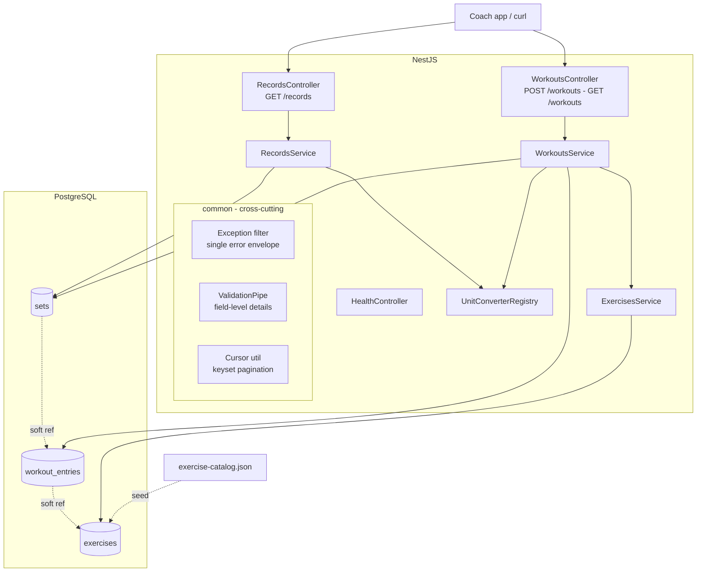

# Everfit Workout Logging API

A workout logging API for coaches to track client metrics over time: log
exercises (bulk, multi-unit), browse filtered history, and track personal
records — built with NestJS + PostgreSQL + TypeORM.

📹 **Walkthrough video:** [Google Drive](https://drive.google.com/file/d/1KjWUigjOY-klGTj4oO16tQCMDzezQCQ0/view?usp=sharing)

## Quick Start

```bash
docker compose up
```

That single command starts Postgres, runs migrations, seeds the database
(exercise catalog + two demo users) and boots the API on
[http://localhost:3000](http://localhost:3000). Interactive API docs:
[http://localhost:3000/docs](http://localhost:3000/docs).

Try it immediately with the seeded data:

```bash
# History for the readable demo user (returns lb on request)
curl "localhost:3000/workouts?userId=demo-user&exercise=bench&unit=lb"

# PRs: June vs May comparison with deltas
curl "localhost:3000/records?userId=demo-user&exercise=Bench%20Press&from=2026-06-01&to=2026-06-30&compareFrom=2026-05-01&compareTo=2026-05-31"

# Performance check against the 50k-entry user
curl "localhost:3000/workouts?userId=perf-user&limit=50"
```

### Local development

```bash
cp .env.example .env       # defaults match docker compose
docker compose up postgres # database only
npm install
npm run migration:run
npm run seed
npm run start:dev
```

### Tests

```bash
npm test          # unit: conversions, Epley, cursor codec, uuidv7
npm run test:e2e  # integration + perf smoke (needs the compose Postgres)
```

## Architecture



Module boundaries: `units/` (conversion registry), `exercises/` (catalog +
muscle-group mapping), `workouts/` (log + history), `records/` (PRs),
`health/`, `common/` (error envelope, validation, pagination), `database/`
(migrations, seeds). Dependencies flow one way: workouts → units + exercises,
records → units + exercises. No cycles.

## API

Full request/response schemas live in Swagger at `/docs`. Summary:

### POST /workouts — log a workout (bulk)

```json
{
  "userId": "demo-user",
  "date": "2026-07-01",
  "entries": [
    {
      "exerciseName": "Bench Press",
      "sets": [
        { "reps": 10, "weight": 100, "unit": "kg" },
        { "reps": 8, "weight": 225, "unit": "lb" }
      ]
    }
  ]
}
```

- Multiple exercises per request; the whole request is one transaction
  (all-or-nothing).
- Weights are normalized to kg at insert (`weightKg`) alongside the original
  value and unit.
- Unknown exercise names are auto-created with muscle group `unknown` —
  logging never blocks on catalog gaps.
- `201` with the created entries; `400` with per-field details on validation
  errors.

### GET /workouts — filtered history

Query params: `userId` (required), `exercise` (partial match), `from`, `to`,
`muscleGroup`, `unit` (kg|lb, response conversion), `cursor`, `limit`
(default 20, max 100).

- Cursor-based (keyset) pagination ordered by `workout_date DESC, id DESC`;
  `pagination.nextCursor` is `null` on the last page.
- Weights are returned in the requested unit; `originalWeight`/`originalUnit`
  always preserved.
- An empty result is `200` with `data: []` and a human message — not an error.

### GET /records — personal records

Query params: `userId` (required), `exercise` (required, exact
case-insensitive), `from`, `to`, `compareFrom` + `compareTo` (pair), `unit`.

- Returns max weight, max volume (reps × weight) and best estimated 1RM
  (Epley: `weight × (1 + reps/30)`), each with the date it was **first**
  achieved (earliest-date tie-break).
- With a comparison range: second set of records plus `delta` per PR type.
- A range with no data returns `records: null` + message (`200`), never an
  error. Unknown exercise → `404`.

### Error envelope

Every failure has one shape:

```json
{ "error": { "code": "VALIDATION_ERROR", "message": "...", "details": [
  { "field": "entries.0.sets.1.weight", "message": "must not be less than 0" }
] } }
```

| Code | Status | Meaning |
|---|---|---|
| `VALIDATION_ERROR` | 400 | Malformed input; `details` lists field paths |
| `UNSUPPORTED_UNIT` | 400 | Unit not in the registry; message lists supported units |
| `INVALID_CURSOR` | 400 | Pagination cursor malformed |
| `NOT_FOUND` | 404 | Unknown exercise/route |
| `INTERNAL` | 500 | Unexpected error; stack goes to logs, never to clients |

## Database Schema & Design Decisions

```
exercises        id SERIAL PK · name TEXT · muscle_group TEXT
                 UNIQUE INDEX ux_exercises_name_lower (LOWER(name))

workout_entries  id UUID PK (UUIDv7, app-generated) · user_id TEXT
                 exercise_id (soft ref) · workout_date DATE · logged_at TIMESTAMPTZ
                 INDEX ix_entries_user_exercise_date (user_id, exercise_id, workout_date DESC)
                 INDEX ix_entries_user_date_id      (user_id, workout_date DESC, id DESC)

sets             id BIGSERIAL PK · entry_id (soft ref) · position · reps
                 weight_original NUMERIC(8,3) · unit_original TEXT
                 weight_kg NUMERIC(8,3)
                 volume_kg  GENERATED ALWAYS AS (reps * weight_kg) STORED
                 est_1rm_kg GENERATED ALWAYS AS (weight_kg * (1 + reps/30.0)) STORED
                 CHECKs: reps > 0, weights >= 0, position > 0
                 INDEX ix_sets_entry (entry_id)
```

**Why PostgreSQL over MongoDB.** PRs and history are aggregation problems
(`MAX` over computed values, multi-filter range scans). Relational sets +
composite B-tree indexes + generated columns answer them with single indexed
queries; CHECK constraints enforce value sanity below the app layer.

**Why soft foreign keys (no `REFERENCES`).** Table relationships are enforced
at the application layer, not by FK constraints. The write path only ever
inserts ids it resolved or created within the same request (exercise ids come
from `findOrCreateByName`, entry ids are generated app-side immediately before
their sets), and the API has no delete endpoints — so the orphan-creating
scenarios FKs guard against don't exist in this codebase. Dropping them keeps
the hot insert path free of per-row FK lookups and keeps the schema ready for
partitioning (Postgres FKs cannot span partitions). Trade-off accepted: the
DB no longer blocks orphans, so any future delete feature must remove children
first (the test cleanup helper already follows this discipline).

**Why generated columns.** Workout data is append-only and read-heavy —
compute once at write, read many. The Epley/volume formulas live in exactly
one place (the migration), the DB guarantees the values can never drift from
`reps`/`weight_kg`, and PR queries become `MAX()` over stored columns.

**Why `weight_kg` is app-computed** (not a DB formula): conversion factors
belong to the unit registry so adding a unit is a one-line code change with
zero migration (`unit_original` is TEXT, deliberately not an enum).

**Why UUIDv7 for `workout_entries.id`.** Time-ordered ids insert
sequentially into the B-tree (no random page splits at 50k+ rows/user, unlike
UUIDv4) while staying unguessable; generated app-side so a bulk request needs
no RETURNING round-trip. The big table (`sets`) uses plain BIGSERIAL — UUID
only where ids are exposed publicly. Trade-off: v7 embeds a creation
timestamp; workout time is public API data here, so nothing leaks.

**Index → query mapping.**

| Index | Serves |
|---|---|
| `ix_entries_user_date_id` | History pages: matches `ORDER BY workout_date DESC, id DESC` exactly; the cursor's row-tuple comparison `(workout_date, id) < (d, id)` seeks straight to the page start — page 1000 costs the same as page 1 (verified: 0.06ms mid-dataset at 50k entries) |
| `ix_entries_user_exercise_date` | PRs + per-exercise history: equality on user+exercise narrows 50k rows to one exercise's ~5k before any math (PR query: ~16ms over 125k sets) |
| `ux_exercises_name_lower` | Case-insensitive exercise identity ("bench press" = "Bench Press") |
| `ix_sets_entry` | Loading a page's sets via one `IN` query |

**Two-step history load.** Entries page first, then sets via `IN` — joining
sets directly would multiply rows and break `LIMIT` semantics.

## Timezone Strategy

Two separate concepts, two columns:

- `workout_date DATE` — the business date, **decided by the client**. A
  workout on "July 1st" belongs to July 1st in the user's own calendar; the
  server never re-interprets it through any timezone.
- `logged_at TIMESTAMPTZ` — the audit instant, stored UTC.

Trade-off: the server can't answer "which workouts happened before 6am local
time" (it never sees local time). For date-based filtering, PRs and history —
everything this API does — client-owned dates are simpler and correct.
Alternative (store UTC timestamp + tz offset) adds complexity only needed for
time-of-day analytics.

## Concurrency

Logging is **append-only**: no read-modify-write, so concurrent requests
cannot corrupt data or lose updates, and two identical entries are two
legitimate workout events (same set twice in one day is real gym data — the
server must not dedupe it silently). Atomicity of one bulk request comes from
a single transaction. Exercise auto-creation races are settled by the
`LOWER(name)` unique index + `ON CONFLICT DO NOTHING` + re-select.

Deliberately **not** implemented: idempotency keys. They solve client-retry
dedup, which needs the client to declare intent ("this is the same action") —
if retries become a product requirement, an `Idempotency-Key` header with a
`(user_id, key)` unique index is the extension point.

## What I'd Change at Scale (10,000 concurrent coaches)

1. **PR caching** — PRs change only on writes; keep a `user_exercise_records`
   summary table updated in the write transaction (or async), turning PR
   reads into single-row lookups.
2. **Trigram index** (`pg_trgm`) on `exercises.name` if the catalog grows to
   thousands — today ILIKE runs after the user index narrows the set, so a
   btree suffices.
3. **Read replicas** — history/PR reads dominate; route them to replicas,
   writes to primary.
4. **Partitioning** `workout_entries`/`sets` by hash(user_id) once the tables
   pass ~100M rows, keeping per-user index depth flat.
5. **Rate limiting + auth** — out of scope per the assignment, first thing to
   add in reality.
6. **Connection pooling** (pgbouncer) in front of Postgres for 10k concurrent
   connections.

## Known Issues

- `npm audit` reports transitive advisories via the current `@nestjs/core`
  (multer chain); no non-breaking fix is published at the time of writing.
